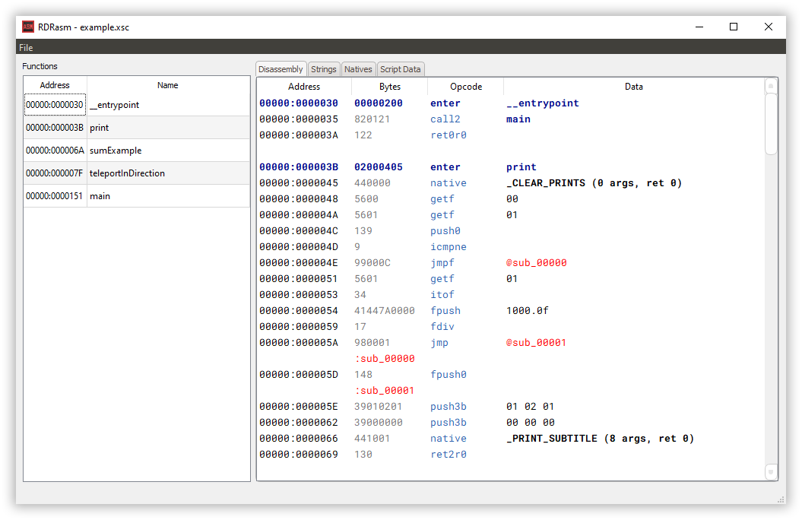

# RDRasm
Disassembler for Red Dead Redemption scripts.

# Download
For the latest download, navigate to the releases tab, or click [here](https://github.com/connorms/RDRasm/releases).

# Features
- PS3 (.csc) disassembly
- Xbox 360 (.xsc) disassembly
- Export raw data
- Export disassembly
- Convert script to .csc
- Convert script to .xsc

# Usage
I've provided a simple example script that is intended to be used to see how the program works, without needing to extract a script from the game. I've provided the source code of that script as well, to be able to compare the disassembly with the source code of the script.

**IMPORTANT NOTE:** For the program to work, you will need to provide RDR's AES key, and put it in a file named `rdr_key.bin` in the root folder of the exe. Without this, it's not possible to decrypt compiled scripts. It can be found in any other RDR tool used to open RPFs, I just can't provide it due to copyright stuff.

# Building
This is intended to be built using Qt Creator with Qt 5.15.0, using MSVC 2019 32bit. It may work with other configurations, but I haven't tried with any other ways.

**NOTE:** Both xcompress32.dll and zlib1.dll are required for running. They are supplied in `/bin/`, but they must be placed in the root directory of the exe for the program to run.

# Special Thanks
* [SC-CL Team](https://bitbucket.org/scclteam/sc-cl/src/master/)
* Twisted89 - RPFTool
* CabooseSaysWTF - Testing